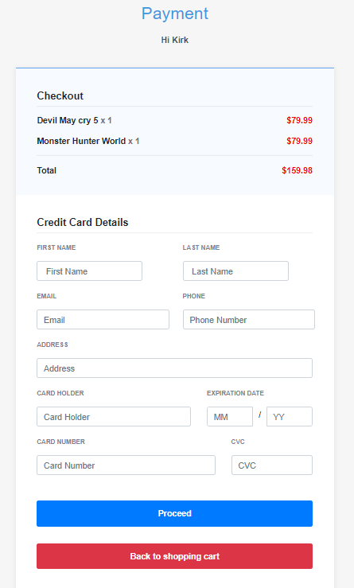

# shoppingCartSystem
 
##### The shopping cart System is an online shopping website created by Kirklin Taylor and Weiming Chen. The website is made with Node Express, Javascript, HTML, and CSS. The functionality of the website includes browsing items in stock, purchasing items. The website is also equip with a fully functional login authentication system, and a user profile. Note that the products here are just for demostration, no actual products are being sold. 
##### Any questions or to see an demostration of the website, please contact Kirklin Taylor.

## Features:

##### -User Authentication (username,password)
##### -Registration page
##### -Ability to reset password, delete account
##### -User profile
##### -Product listing page
##### -Single product page
##### -Shopping cart
##### -Checkout page
##### -Product review / rating a product
##### -Administration page

# Highlights of features available:

## Login Page

## Main page to browse products

## Pop-up to display a product when clicked

## Page to make payments

